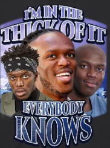

# Premise

Cybersecurity can feel overwhelming to get into... the technical terminology, the sheer amount of topics, and the gap between theory and actually doing things, it's very easy to get lost.

This handguide exists because I am that person who was overwhelmed. I'm a 22 years young Computer Science graduate who went through hackathons, internships, and a professional security academy, and I'm still learning. I don't have all the answers, I am very far from that. I'm figuring a lot of this out as I go too.

So that's what this is. A resource written by someone in the thick of it, for people in the thick of it (😭).

<figure><figcaption></figcaption></figure>

Not a textbook, not a course, not a list of commands to copy and paste. Just concepts explained the way I understand them, all in one place (from the root up lolll).

I'll cover everything as I go along from fundamentals to web, API, mobile, and infrastructure security, tools, current cybersecurity topics, bug bounties as well as practical walkthroughs.&#x20;

Some topics I'm exploring myself for the first time alongside you. It also includes my personal journey, experiences, and thoughts along the way, because I think that side of things matters just as much as the technical content.

It gets updated as I learn. If something is wrong or could be better, that's kind of the point and is part of the process.

If you're starting out, feeling stuck, or just want a second explanation of something then please do stick around. Also I hope you don't mind the unnecessary yap or memes sometimes but where is the fun without such??

<figure><figcaption></figcaption></figure>
